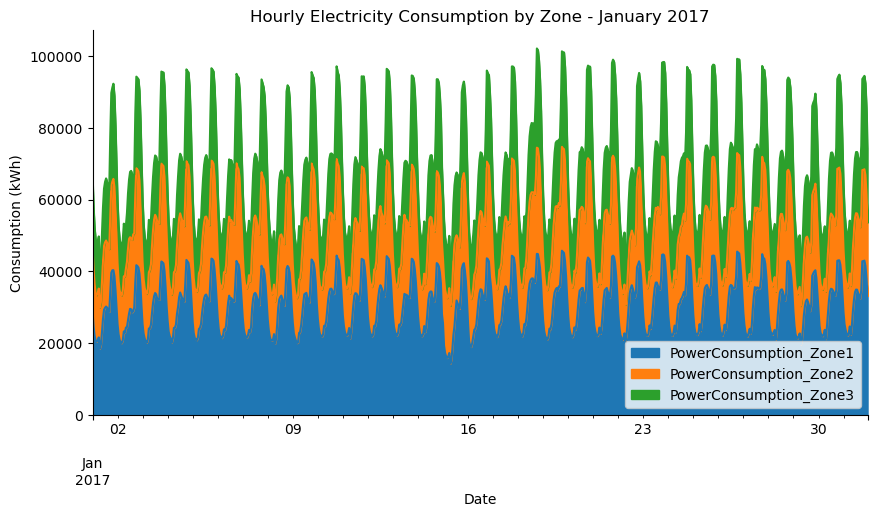
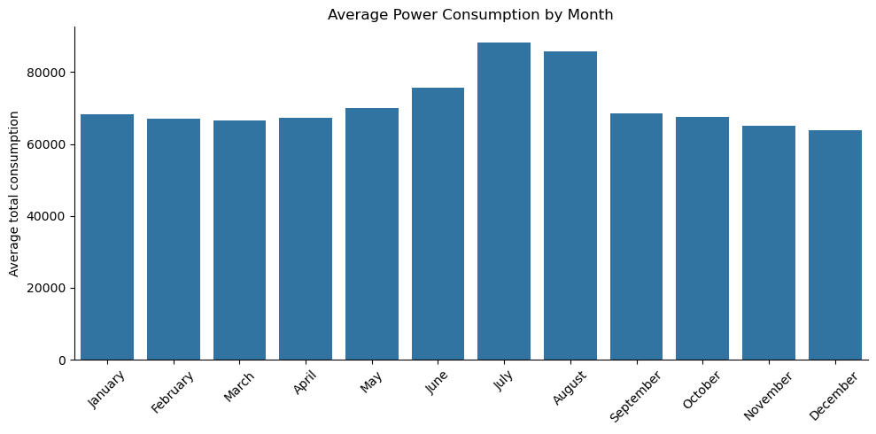
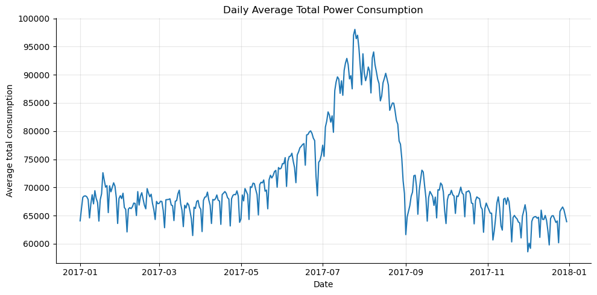
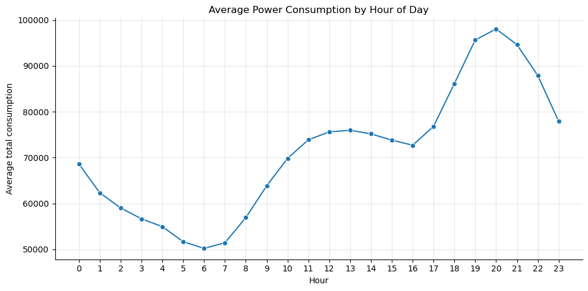
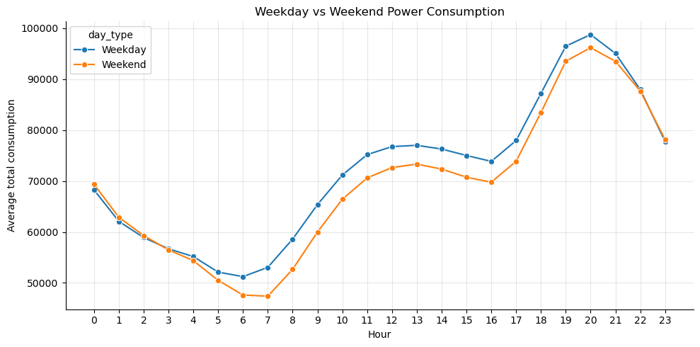
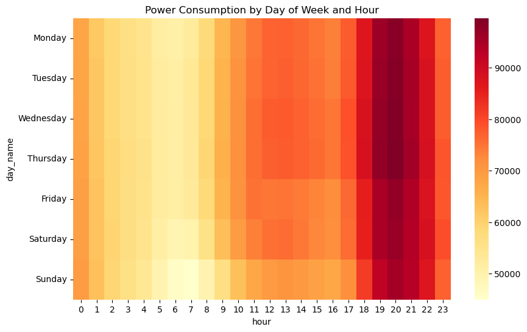
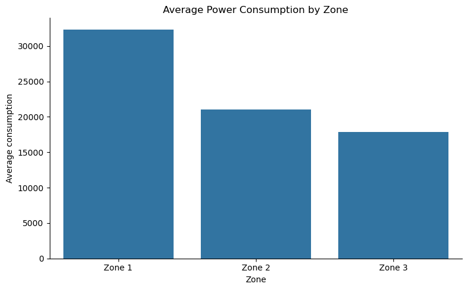
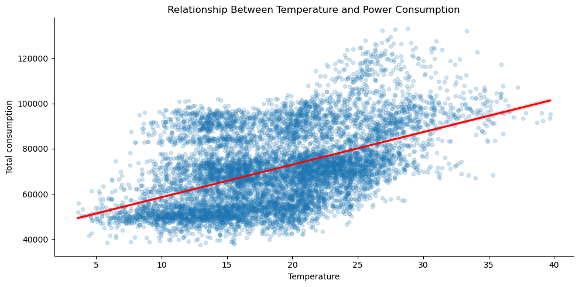

# Power Consumption Analysis

Exploratory data analysis of electricity consumption in three distribution zones in Tetouan, Morocco.

## Project overview

This project explores electricity demand recorded every 10 minutes during 2017. The analysis compares the three zones and examines:

- daily and monthly consumption patterns;
- hourly demand and peak hours;
- weekday and weekend profiles;
- average consumption by zone;
- the relationship between temperature and total consumption.

## Key findings

### Data quality

Before looking for patterns, I checked the data for gaps and repeated rows. The dataset contains 52,416 readings, recorded every ten minutes throughout 2017. There are no missing values and no duplicate rows, so I could use the full dataset for the hourly, daily, and monthly comparisons.


### All three zones follow the same rhythm in January

Zone 1 has the highest average electricity consumption among the three zones. All three zones show clear and recurring daily consumption patterns throughout January, with noticeable fluctuations in demand. 



### Strong summer seasonality

The clearest pattern is the increase in electricity consumption during the summer. Average total consumption rises from around 66.6k in March to 88.2k in July, which is the highest monthly level. December has the lowest average consumption at around 63.8k.

What stands out is how quickly consumption changes around the summer peak. It increases noticeably from June to July, remains high in August, and then drops again in September.



The daily chart gives a closer look at the same pattern. The highest average consumption is seen on 25 July, while the lowest occurs on 1 December.

Another thing that stands out is the regular dips throughout the year. They appear at similar intervals, suggesting a repeating weekly pattern rather than random changes in consumption.



### Most electricity is used in the evening

Electricity consumption varies throughout the day. It drops overnight and reaches its lowest point around 06:00. From there, it gradually increases during the morning, stays relatively stable in the afternoon, and then rises noticeably after 17:00.

Consumption reaches its highest level around 20:00. The evening hours, especially 19:00–21:00, stand out as the main peak-demand period.


### Weekday and weekend patterns are more similar than I expected

There is not a big difference between weekdays and weekends overall. Average consumption is slightly higher on weekdays, while both follow a very similar pattern overnight and reach their highest point around 20:00.

The biggest difference can be seen in the morning. At around 08:00, electricity use is noticeably higher on weekdays than on weekends. This could be because people tend to start their day earlier during the working week.



### The evening peak appears on every day of the week

The heatmap makes it easier to see how electricity consumption changes across different days and hours. The highest average consumption occurs at 20:00 on every day of the week, with Thursday at 20:00 showing the highest value at 99.6k.



The lowest point is on Sunday at 07:00, at 45.0k. Weekend mornings are generally quieter than weekday mornings, especially between 05:00 and 08:00. However, this difference becomes much smaller in the evening, when consumption stays high on both weekdays and weekends. This suggests that the evening peak is a consistent pattern throughout the week, rather than something driven only by working days.

### Zone 1 uses noticeably more electricity
Zone 1 clearly has the highest electricity consumption among the three zones. Its average consumption is around 32.3k, compared with 21.0k for Zone 2 and 17.8k for Zone 3.

This means Zone 1 accounts for almost half of the total average consumption and uses noticeably more electricity than the other two zones. Because of this, Zone 1 would be the first area to look at when investigating opportunities to improve energy efficiency.


### Temperature is relevant, does not explain demand alone

Temperature and total consumption have a positive correlation of 0.49. In general, electricity use tends to be higher on warmer days, which matches the summer peak seen earlier.

At the same time, the points on the chart are quite spread out. Similar temperatures can still be linked to very different levels of consumption. So temperature clearly matters, but it does not explain everything by itself. Time of day, weekday or weekend activity, season, and other weather conditions are also likely to play a role.



## Repository structure

```text
.
├── assets/                 # Charts used in this README
├── powerconsumption.ipynb  # Analysis, visualizations, and findings
├── requirements.txt        # Python dependencies
├── .gitignore
└── README.md
```

## Dataset

The project uses the [Power Consumption of Tetouan City](https://archive.ics.uci.edu/dataset/849/power+consumption+of+tetouan+city) dataset from the UCI Machine Learning Repository.

Download the CSV file, rename it to `powerconsumption.csv`, and save it as:

```text
data/powerconsumption.csv
```

The raw dataset is excluded from Git because it can be downloaded from the original source.

## Run locally

```bash
python -m venv .venv
source .venv/bin/activate
pip install -r requirements.txt
jupyter notebook powerconsumption.ipynb
```

On Windows, activate the environment with `.venv\Scripts\activate`.

## Technologies

Python, Jupyter Notebook, pandas, NumPy, Matplotlib, and Seaborn.

## Dataset citation

Salam, A. & El Hibaoui, A. (2018). *Power Consumption of Tetouan City*. UCI Machine Learning Repository. https://doi.org/10.24432/C5B034
